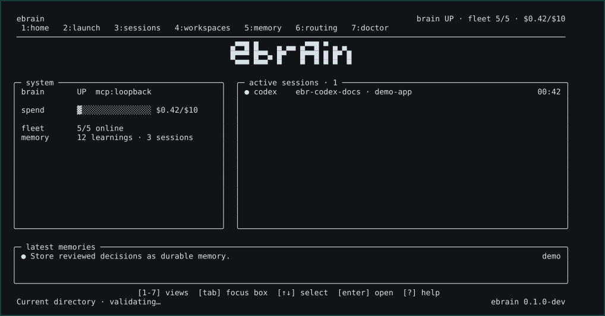

<p align="center">
  
</p>

<p align="center">A local-first control plane for persistent agent memory, workspaces, and coding sessions.</p>

<p align="center">
  <a href="https://github.com/aedneth/ebrain/actions/workflows/ci.yml"></a>
  <a href="LICENSE"></a>
  <a href="https://bun.sh"></a>
  <a href="https://modelcontextprotocol.io"></a>
</p>

<p align="center">
  <a href="https://ebrain.vercel.app/demo/">Live demo</a>
  &middot;
  <a href="https://github.com/aedneth/ebrain">GitHub</a>
  &middot;
  <a href="docs/PUBLIC-DOCUMENTATION.md">Documentation</a>
  &middot;
  <a href="CONTRIBUTING.md">Contributing</a>
  &middot;
  <a href="https://x.com/aedneth">X</a>
  &middot;
  <a href="https://www.linkedin.com/in/eduardo-borjas/">LinkedIn</a>
</p>

[](https://ebrain.vercel.app/demo/)

<p align="center"><a href="https://ebrain.vercel.app/demo/">Watch the animated demo</a> — the real cockpit and a cross-agent memory hand-off, rendered from the production renderer.</p>

**Coding agents start from zero every session, and each one keeps its own context. eBrain gives them a single governed memory that outlives the session and crosses agents — on your own machine.**

eBrain gives local coding agents a shared, governed memory layer and gives developers one terminal cockpit for the work around it. It starts a single authenticated MCP daemon on loopback, onboards supported local agent CLIs, launches persistent workspace-backed sessions, and records bounded memory and factual token telemetry without turning every transcript into context.

The result is a local control plane for work that otherwise gets scattered across agent terminals: decisions worth retaining, reusable procedures, validated project directories, active sessions, explicit routing choices, and the usage data that providers actually return.

## Five-minute proof

Requirements: [Bun](https://bun.sh), git, tmux for persistent sessions, and at least one supported local agent CLI. The source install retrieves the pinned upstream knowledge engine separately; see [third-party notices](THIRD_PARTY_NOTICES.md) for the attribution boundary.

```bash
git clone https://github.com/aedneth/ebrain.git ebrain
cd ebrain
bun install
./scripts/install.sh --from-source

# One idempotent boot: local credential, loopback daemon, and detected adapters.
ebrain up
ebrain doctor

# Retain one reviewable decision, then retrieve it through approved sources.
ebrain remember "Review a database migration before merge."
ebrain q "what must happen before a database migration merges?"

# Open the terminal cockpit from any real interactive terminal.
ebrain
```

`ebrain up` owns local MCP credential creation before the daemon binds, starts the shared daemon, and attempts adapter onboarding. You do not paste a token, hand-manage a writer lock, or configure an OAuth flow to take this path. A missing local CLI remains visible as unavailable instead of being reported as connected.

## What you can do

| Outcome | eBrain behavior | Boundary that stays explicit |
| --- | --- | --- |
| Keep agents on one memory plane | One authenticated loopback MCP daemon owns the knowledge-engine writer path and bridges supported local CLIs. | Federation is opt-in; a clean install works with local memory alone. |
| Retain useful decisions without transcript dumping | Durable learnings, context packs, scrubbed episodes, and procedures each have a separate lifecycle. | A terminal pane or prompt is not automatically memory. |
| Run work in the right project | Register validated directories and launch persistent tmux sessions from the selected workspace. | Existing sessions keep their original canonical working directory. |
| Start an agent with low friction | Manual launch starts the local agent you selected; a guided path previews a target, profile, capability, task, and workspace. | eBrain does not choose a universally best model or agent. |
| Reuse a process deliberately | Materialize a workflow as a prompt or checklist and track procedure use and human review. | Materialization never executes an arbitrary command or declares a run successful. |
| Understand provider usage | Group supplied token and usage data by provider, agent, model, session, or workflow when available. | eBrain does not report subscription charges as token usage or invent missing provider telemetry. |
| Keep a local safety posture | Loopback-only MCP, secret-shaped input handling, source isolation, confirmation gates, and scrubbed session peeks. | These controls complement, not replace, a review of installed agent CLIs and local configuration. |

## Why a shared local control plane

Coding agents are useful in isolated terminals, but the surrounding developer workflow is usually fragmented:

- one CLI has a useful decision that another CLI cannot retrieve;
- several processes can contend for an embedded knowledge writer;
- a session starts in whichever directory happened to be open;
- a useful workflow becomes an unsearchable chat message;
- provider dashboards expose incomplete or incomparable cost signals; and
- a routing suggestion can quietly become a claim that one model is always best.

eBrain is designed around the durable parts of that workflow. It makes the local daemon, memory boundaries, workspace identity, session lifecycle, model choice, and usage provenance visible to the developer. It does not replace the developer's judgment with an opaque recommendation engine.

## One command, one daemon, many local agents

```text
supported local CLIs                eBrain control plane

Claude Code / Codex / Gemini  -->   command-only MCP bridge
Cursor / OpenCode / generic    -->   authenticated loopback daemon
                                        |
                                        +--> approved local knowledge sources
                                        +--> bounded memory and procedure metadata
                                        +--> workspace-backed tmux sessions
                                        +--> terminal UI and structured CLI
```

The daemon is the single local owner of the shared writer path. `ebrain up` is idempotent: it creates or reuses the private local credential before binding, starts the daemon, detects supported adapters, and runs bounded local checks. `ebrain onboard --all` can repeat adapter registration without exposing credential material.

```bash
ebrain up
ebrain onboard --all
ebrain daemon status
ebrain fleet --json
```

Read the [boot and onboarding guide](docs/getting-started/onboarding.md), [supported-agent guide](docs/guides/agents.md), and [MCP reference](docs/reference/mcp.md) for the operational contract.

## Compound personal context

eBrain is not a claim that every past message should be injected into every future prompt. It is a way to compound context intentionally. Each layer has a source of truth, an explicit write path, and a retrieval boundary.

| Layer | What it keeps | How it becomes available |
| --- | --- | --- |
| Durable learning | A concise decision, preference, or operational fact worth reusing. | A developer or an approved agent action records it through the governed path. |
| Context pack | Stable operating guidance for an operator or workspace. | Human updates are versioned; proposals require explicit review before activation. |
| Episode | A scrubbed, immutable local summary for bounded recall. | It is intentionally recorded or mirrored after an approved durable learning. |
| Workflow and procedure | Reusable process content plus explicit-use and review metadata. | A workflow materializes a prompt or checklist; review controls lifecycle state. |
| Federated knowledge | Compatible sources the developer deliberately approves. | The daemon searches configured sources subject to local isolation policy. |

The practical loop is simple:

1. Capture a decision that will matter after the terminal closes with `ebrain remember` or an approved MCP action.
2. Put stable, reusable operating context in a versioned context pack instead of a hidden prompt.
3. Search approved sources with `ebrain q` or bounded episode recall when a task needs history.
4. Turn a repeatable process into a workflow or procedure, then materialize it for review in the next session.
5. Review context and procedure changes explicitly so a speculative agent response never silently becomes your long-term operating policy.

This gives agents a shared place to retrieve governed knowledge while preserving a developer's ability to inspect what was retained and why. It does not automatically scrape conversations, train a model, mutate preferences, or convert raw terminal output into durable memory.

Explore the [memory model](docs/concepts/memory.md), [context packs](docs/memory/context-packs.md), [episodes](docs/memory/episodes.md), and [procedures and workflows](docs/memory/procedures-and-workflows.md).

## From CKIS to eBrain

eBrain grew from the practical knowledge-infrastructure work behind [CKIS](https://github.com/aedneth/ckis). CKIS focuses on organizing knowledge sources, authoring, graph tooling, and optional federated workflows. eBrain is the developer runtime built on the next question: once knowledge exists, how do multiple local coding agents safely retrieve it, retain useful new decisions, and work across projects without lock choreography?

That relationship is deliberate rather than mandatory:

| CKIS | eBrain |
| --- | --- |
| Knowledge infrastructure and optional federation | Runtime control plane for agents, workspaces, sessions, routing, and telemetry |
| Source organization and graph-oriented workflows | Loopback MCP daemon, agent onboarding, and terminal cockpit |
| Can hold structured knowledge sources | Can start clean with local eBrain stores and add compatible sources later |

A new developer does not need a pre-existing vault, another person's procedures, or private CKIS data to use eBrain. Start locally, add approved sources when their boundaries are understood, and keep the resulting context portable and reviewable. See the [CKIS relationship](docs/architecture/ckis.md) and [daemon and federation architecture](docs/architecture/daemon-federation.md) for the technical separation.

## Launch work where it belongs

eBrain treats a workspace as a validated directory identity, not an arbitrary shell payload. The workspace registry gives a developer a repeatable place to launch agents and inspect the sessions already working there.

```bash
ebrain workspaces list --json
ebrain sessions list --json
ebrain
```

Inside the TUI, the daily flow is intentionally direct:

1. Choose a registered workspace or register a validated local directory.
2. Open **Launch** and select a manual agent when you already know what to run.
3. Press Enter and eBrain creates a persistent tmux session in that workspace.
4. The cockpit switches to **Sessions** automatically so the new process is immediately visible.
5. Attach, inspect a scrubbed peek, compose a multiline prompt, or stop the session through the confirmed control path.

Manual and guided launch are separate on purpose.

| Launch path | Use it when | What it does not change |
| --- | --- | --- |
| Manual agent | You know the locally installed CLI you want to start. | It does not modify a routing profile or infer a model. |
| Guided launch | You want a reviewable target, profile, capability, workspace, and task preview. | It does not recommend a provider, rank models, or launch on preview. |
| Task setup | You want an explained work category plus an optional exact task. | It does not classify a prompt into a hidden provider decision. |

The TUI has seven connected views: **Home**, **Launch**, **Sessions**, **Workspaces**, **Memory**, **Routing**, and **Doctor**. Every visible control is keyboard-driven, responsive at supported terminal sizes, and presented with its valid action keys. `ebrain ui` remains a compatible explicit alias, while bare `ebrain` opens the cockpit from a real interactive terminal.

Read [manual launch](docs/launch/manual-launch.md), [guided launch](docs/launch/guided-launch.md), [workspaces and sessions](docs/concepts/workspaces-sessions.md), and the [TUI reference](docs/reference/tui.md).

## Token and provider telemetry

eBrain makes a careful distinction between a provider choice, a routing budget, and observed usage.

- **Profiles and targets are user-owned.** A profile is a local provider/model map organized by capability. A target is an adapter declaration able to represent an explicit selection safely.
- **Task signals are orientation.** They explain a task's capability; they do not determine which model a developer should use.
- **OpenRouter and other providers are optional.** A developer can use an OpenRouter profile with models they chose, mix compatible providers, or launch a local CLI manually.
- **Costs are factual when supplied.** The cost view groups known token and usage records by provider, agent, model, session, and workflow. It leaves unavailable data unavailable.
- **Subscription prices are out of scope.** A monthly plan or a price snapshot is not the same as tokens consumed by a model, so eBrain does not merge them into usage telemetry.

```bash
ebrain task-profile "Refactor a typed API client" --json
ebrain profiles list --json
ebrain targets list --json
ebrain routing --json
ebrain cost --json
ebrain spend --json
```

This design avoids stale benchmark theater. Model behavior, availability, and pricing change; the developer owns the profile, sees the declared route, and can inspect the usage returned for the work that actually ran. See [routing](docs/guides/routing.md), [profiles and targets](docs/routing/profiles-and-targets.md), and [token and provider telemetry](docs/concepts/costs.md).

## CLI and TUI at the same boundary

The terminal UI is a daily control surface, not a second product with different semantics. The same structured CLI operations back its state.

| Area | Daily CLI | TUI surface |
| --- | --- | --- |
| Health | `ebrain status --json`, `ebrain doctor` | Home and Doctor |
| Agent adapters | `ebrain onboard --all`, `ebrain fleet --json` | Home and Doctor |
| Memory | `ebrain remember`, `ebrain q`, `ebrain memory recent --json` | Memory |
| Context and procedures | `ebrain context`, `ebrain episodes`, `ebrain procedures`, `ebrain workflows` | Memory and Launch |
| Projects | `ebrain workspaces`, `ebrain sessions` | Workspaces and Sessions |
| Routing and usage | `ebrain task-profile`, `ebrain profiles`, `ebrain targets`, `ebrain cost` | Launch and Routing |

The [CLI reference](docs/reference/cli.md) is the command index. JSON output is intended for local automation and the TUI; it is not a promise to expose raw private data, file paths, prompt bodies, or credential material.

## Security and privacy boundaries

eBrain is local-first, but local is not permission to index every local file or emit every local string into an agent prompt. The product boundary includes:

- an authenticated daemon bound to loopback rather than a public network listener;
- private local credential storage that is never printed into prompts or adapter configuration;
- command-only adapter bridges instead of copied bearer material;
- explicit source registration and deny-first isolation checks;
- secret-shaped content handling at relevant memory, workflow, and display boundaries;
- scrubbed, bounded session peek rather than raw terminal export; and
- confirmation gates for destructive session actions and reviewed prompt delivery.

Developers should still keep credentials out of prompts and source documents intended for indexing, review installed third-party tools, and follow their own incident process. Read [SECURITY.md](SECURITY.md) and the [privacy and isolation guide](docs/guides/privacy.md) before connecting additional sources.

## Documentation

The canonical public documentation is Markdown in this repository and powers a static documentation site. It is written for a clean installation first and separates available behavior, optional configuration, and planned work.

| Start here | Learn the model | Operate safely |
| --- | --- | --- |
| [Install](docs/getting-started/install.md) | [Memory layers](docs/concepts/memory.md) | [Privacy and isolation](docs/guides/privacy.md) |
| [Quick start](docs/getting-started/quickstart.md) | [Workspaces and sessions](docs/concepts/workspaces-sessions.md) | [Diagnostics](docs/reference/diagnostics.md) |
| [Boot and onboarding](docs/getting-started/onboarding.md) | [Procedures and skills](docs/concepts/procedures.md) | [Safe migration](docs/guides/migration.md) |
| [First memory](docs/getting-started/first-memory.md) | [Daemon and federation](docs/architecture/daemon-federation.md) | [Configuration](docs/reference/configuration.md) |
| [Workspace and session](docs/getting-started/workspace-session.md) | [CKIS relationship](docs/architecture/ckis.md) | [Troubleshooting](docs/guides/troubleshooting.md) |

The same documentation is published at **https://ebrain.vercel.app**. Build it locally with:

```bash
bun run website:build
```

The build reads only the allowlisted public Markdown tree, and the site is static output with no server adapter, no provider calls, and no runtime credential requirement. The hosted copy adds first-party page-traffic and Core Web Vitals measurement, served same-origin under a `default-src 'self'` content security policy; a local build has neither.

## Contributing

eBrain is built spec-first:

```text
context -> plan -> implementation -> focused verification -> independent review -> release approval
```

Small, testable changes are easier to review and safer for a tool that manages local agent context. High-risk work involving persistence, migrations, architecture, licensing, distribution, or release uses a different checker from the maker. Public output stays in English and must not include credentials, private paths, runtime memory, or customer material.

Before opening a pull request:

```bash
bun test ./cli/
bun test ./tui/test/
bun run website:build
```

Read [CONTRIBUTING.md](CONTRIBUTING.md), [CODE_OF_CONDUCT.md](CODE_OF_CONDUCT.md), the [contributor workflow](docs/release/contributor-workflow.md), and the [open-source readiness guide](docs/release/open-source-readiness.md). Use the repository issue forms for reproducible bugs and outcome-oriented feature proposals; report vulnerabilities through the private path in [SECURITY.md](SECURITY.md).

## Roadmap direction

The current product focuses on reliable local foundations: a shared daemon, supported-agent onboarding, governed memory layers, workspace-backed sessions, user-owned routing choices, and factual token telemetry. Near-term work continues to improve distribution, embedding-provider choice, and reviewed workflow reuse without weakening explicit approval and isolation boundaries.

Exploratory work such as an autonomous runtime, team memory, or native shell capability remains separate from the shipped control plane until its security and lifecycle contracts are proven.

## How this was built with Codex and GPT-5.6

**Codex was the builder.** It implemented the harness, the CLI surface, the seven-view TUI, the shared MCP daemon and command-only bridge, the deny policy in both TypeScript and shell, and the test suites — feature by feature, each behind its own contract. The majority of the implementation work was done in Codex sessions, and the `/feedback` session for the bulk of that work is recorded in the submission.

**GPT-5.6 was the reasoning partner.** The load-bearing design decisions were worked through with GPT-5.6: the daemon-and-federation architecture and its loopback authentication model; the security boundaries (fail-closed source isolation, secret scrubbing, confirmation gates); the deny-policy grammar that must mean the same thing when read by the CLI and by the shell harness; and the governed-memory design that records bounded, reviewable memory instead of dumping every transcript into context.

## Acknowledgements

eBrain integrates the separately installed [gbrain](https://github.com/garrytan/gbrain) knowledge engine and extends lessons from [CKIS](https://github.com/aedneth/ckis). It also benefits from the open MCP ecosystem and the local coding-agent tools it can bridge. See [THIRD_PARTY_NOTICES.md](THIRD_PARTY_NOTICES.md) for dependency and licensing boundaries.

## License

eBrain-authored source is licensed under the [GNU AGPL v3.0 only](LICENSE).
